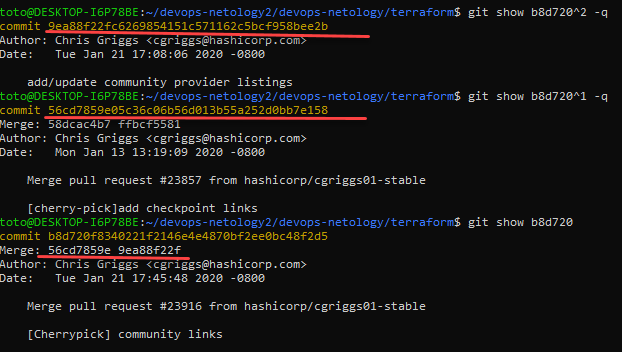

# devops-netology2

1. Найдите полный хеш и комментарий коммита, хеш которого начинается на `aefea`.

2. Какому тегу соответствует коммит `85024d3`? 

3. Сколько родителей у коммита `b8d720`? Напишите их хеши.

4. Перечислите хеши и комментарии всех коммитов которые были сделаны между тегами  v0.12.23 и v0.12.24.

5. Найдите коммит в котором была создана функция `func providerSource`, ее определение в коде выглядит так `func providerSource(...)` (вместо троеточего перечислены аргументы).

6. Найдите все коммиты в которых была изменена функция `globalPluginDirs`.

7. Кто автор функции `synchronizedWriters`? 

